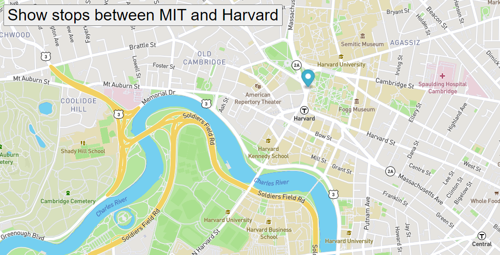

# BusTracker
This project uses 'mapbox', the open-source platform, to create and display maps, using the mapgl JS library.  It displays an animated map of a bus marker, traveling from M.I.T to Harvard.

## Table of Contents
* [Screenshot](#screenshot)
* [Setup](#setup)
* [Usage](#usage)
* [Room for Improvement](#room-for-improvement)
* [Acknowledgements](#acknowledgements)
* [Contact](#contact)
* [License](#license)

## Screenshot

## Setup
- On Github, navigate to the main page of this repository.
- On the top right of the list of files, click the green button, titled 'Code'.
- Copy the URL by clicking on the clipboard button.
- Open Gitbash.
- Change the current working directory to where you want the cloned directory.
- Type:  $ git clone https://github.com/Mitsananikone/BusTracker.
- Press 'Enter' to create your local clone.
- Run index.html.

## Usage
Once index.html is open, you will see a map of Boston with a marker starting at M.I.T University.   
When the button on the top left corner is pressed, the Bus marker will move along the bus route, stopping  
at the appropriate bus stops.

## Room for Improvement
Something I would like to do in the future is to make the marker move between the bus stops, instead of just  
appearing where the bus stops are.  I would like the bus to move from stop to stop.

## Acknowledgements
This project was inspired by Week 9 of the M.I.T Fullstack Developer Bootcamp

## Contact
Created by [@mitsananikone(https://mitsananikone.github.io/)] - feel free to contact me!

## License

